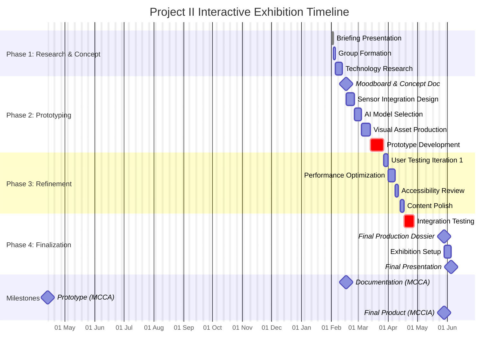

# Project02

## Project II - Interactive Exhibition Timeline

**Mermaid Gantt Chart for README.md**  
**Semester:** 2025-2026 / 2nd Semester  
**Program:** Master's in Creative Computing and Artificial Intelligence (M-CCIA)



---

## Alternative Gantt Chart View

```mermaid
gantt
    title Project II - Simplified Timeline
    dateFormat  YYYY-MM-DD
    axisFormat  %d/%m

    section Phase 1
    Briefing & Formation                :done, p1, Feb 2-9

    section Phase 2 
    Technical Implementation            :active, p2, after p1
    Prototype Development               :crit, p3, after p2

    section Phase 3
    User Testing & Refinement           :p4, after p3

    section Phase 4
    Final Polish & Exhibition Setup     :crit, p5, after p4
```

---

## Timeline Summary

| Phase | Duration | Key Milestones |
|--------|-------|--------|
| **Phase 1: Research** | Feb 2-9 | Briefing, Team formation, Technology selection |
| **Phase 2: Prototyping** | Feb 9 - Mar 30 | Documentation (MCCA), Technical implementation |
| **Phase 3: Refinement** | Apr 1 - May 5 | User testing, Accessibility compliance |
| **Phase 4: Finalization** | May 6-29 | Integration testing, Final dossier, Exhibition setup |

---

## Critical Path Analysis

```
Critical Milestones (Red):
├── Documentation (MCCA): Feb 16 → 15% of grade
├── Prototype (MCCA): Apr/May 2026 → 35% of grade
└── Final Product (MCCIA): May 29 → 50% of grade

Dependencies:
    Research → Prototyping → Refinement → Exhibition Setup → Final Presentation
```

---

*Note: Date discrepancies in original brief require verification with course coordinator.
